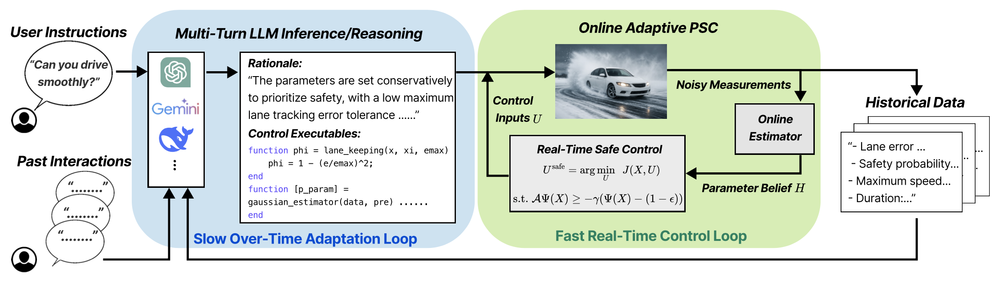
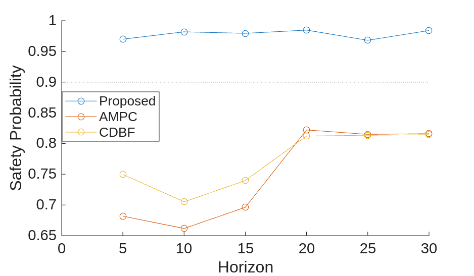
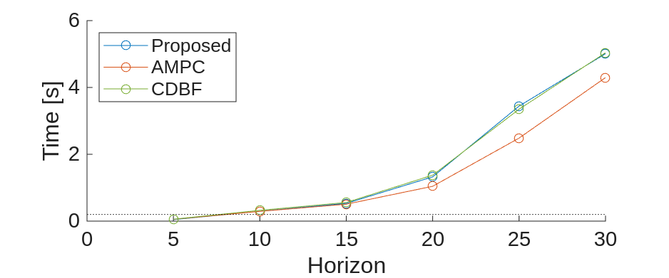
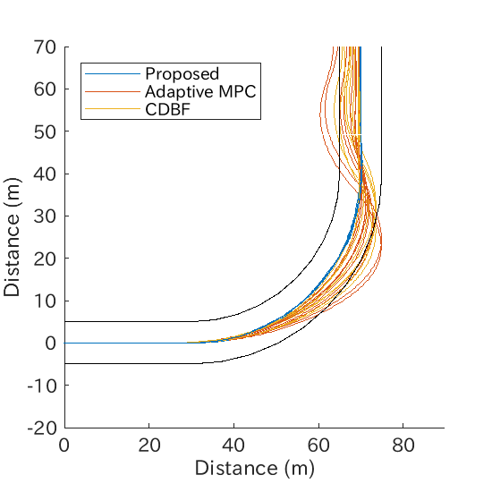
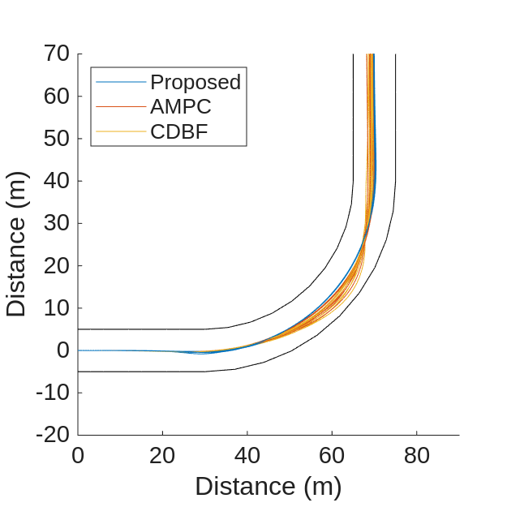
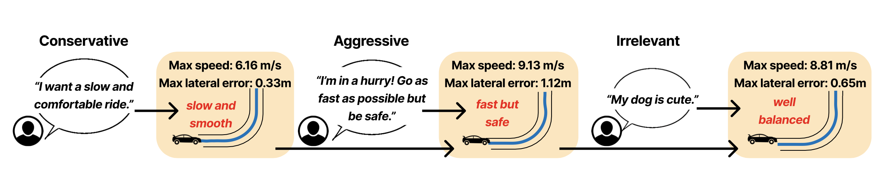

# Adaptive Lane Keeping


Official implementation of the paper ["Online Adaptive Probabilistic Safety Certificate with Language Guidance"](https://arxiv.org/abs/2511.12431), accepted to the 8th Annual Learning for Dynamics & Control Conference (L4DC), 2026.

<br>



<br>

<br>

This repository provides Simulink-based **adaptive lane keeping simulations** with **model predictive control (MPC)**, and **LLM integration** for language instructions.  

The online control framework includes:

- **Adaptive MPC**: vehicle/road model is updated online using friction coefficient estimation.  
- **Proposed**: Adaptive MPC with additional *Probabilistic Safety Certificate (PSC)* constraints.  
- **CDBF**: Adaptive MPC with *Control-Dependent Barrier Function* constraints.  

The performance of these controllers is compared in terms of **computation time**, **safety probability**, and **vehicle trajectories**.

- **Safety probability vs horizon**  
<p align="center">
  
</p>

- **Computational time vs horizon**  
<p align="center">
  
</p>


- **Vehicle trajectories for H=10 and H=20**  
<p align="center">
  
  
</p>


---

## 1. Repository structure

```
.
├─ README.md
├─ codes/
│  ├─ mdl_closed_loop_mpc.slx     ← Main Simulink model
│  ├─ main_single_run.m           ← Run one scenario (quick test)
│  ├─ main_parallel_runs.m        ← Run multiple parallel simulations
│  ├─ compare_phi_expressions.m   ← Compare different barrier function shapes
│  ├─ param_sweep_parallel.m      ← Run massive parallel ablation simulations
│  ├─ impl_controller/            ← MPC, PSC, CDBF implementations
│  ├─ impl_estimator/             ← Friction coefficient estimator
│  ├─ impl_model/                 ← Vehicle and dynamics models
│  ├─ impl_road/                  ← Road description
│  ├─ fun_*                       ← System dynamics, inequality constraints, etc.
│  ├─ mfun_*                      ← Imprementations of MATLAB Functions in Simulink model
│  └─ data_mpc/                   ← Simulation results (saved .mat files) and plotting scripts
│       └─ figs_mpc/              ← Ablation trajectory visualizations and statistics
├─  docs/                         ← Simulink Documentations
└─  LLM/
   ├─ llm_results/                ← Ablation results
   └─ user_inputs/                ← User commands
  
```

For more details on Simulink implementation, see [docs/model_overview.md](docs/model_overview.md).

---

## 2. Requirements

- MATLAB R2025a — development environment (other versions may or may not be compatible)  
- Simulink  
- Model Predictive Control Toolbox  
- Optimization Toolbox  
- Parallel Computing Toolbox (for `main_parallel_runs.m`)  

---

## 3. How to run

### Step 1: Quick test (single run)

```matlab
cd codes
run('main_single_run.m')
```

- Runs one closed-loop simulation with fixed settings.  
- Useful to check if the model, controller, and estimator are working.  
- Visualization can be turned on/off inside the script:
    ```matlab
    set_param([mdl '/visualization'],'Commented','off') % 'on' to disable
    ```
- For quick checks, the number of Monte Carlo samples for safety probability is initially set to `1`:
    ```matlab
    set_param([mdl '/SafeProbabilityMC'],'snum','1') % change to 100 for reproduction
    ```
  - To properly evaluate the Proposed method (PSC) and obtain meaningful safety probability results, increase this setting to `100` or more. When the friction coefficient is at its lowest value (`mu = 0.2`), using around `200` samples is recommended.


### Step 2: Data collection (parallel runs)

```matlab
cd codes
run('main_parallel_runs.m')
```

- Launches parallel simulations with random friction coefficients.  
- Saves results (state, trajectory, safety probability, elapsed time) into `.mat` files under `data_mpc/`.  
- By default the number of trial runs and the number of parallel pools are
    ```matlab
    num_sims = 2;     % quick check
    num_pools = 2;    % number of workers in parallel pool
    ```
- To reproduce the performance plots
    - Set `num_sims = 30`  
    - Adjust `num_pools` depending on your computational environment.

---

## 4. Switching controllers

In `main_single_run.m`, the controller is selected via the `safety_method` parameter:

```matlab
% Standalone: edit the default on line 69
safety_method = 'DIRECT';  % 'PSC', 'CDBF', 'DIRECT', or 'NONE'

% Function call: pass as third argument
results = main_single_run(phi_expr, emax, 'PSC', mu_value);
```

| Method | Constraint Function | Description |
|--------|-------------------|-------------|
| `'PSC'` | `fun_inequality` | Adaptive MPC + Probabilistic Safety Certificate |
| `'CDBF'` | `fun_inequality_CDBF` | Adaptive MPC + Control-Dependent Barrier Function |
| `'DIRECT'` | `fun_inequality_direct_lane_keep` | Direct lane keeping constraint using `fun_safety_condition()` |
| `'NONE'` | *(none)* | Adaptive MPC without safety constraints |

### Note on code generation

- The scripts include an option to generate a MEX function for faster MPC evaluation:
   ```matlab
   code_gen = true;   % build controller as MEX
   ```
- If a MEX has already been built and no changes to the constraints are needed, you can set:
   ```matlab
   code_gen = false;  % reuse previously built MEX (no rebuild)
   ```
- **Important:** If you change the safety constraints (`fun_inequality`, `fun_inequality_CDBF`, etc.), you must re-build the controller (`code_gen = true`) so the compiled MEX matches the new constraints.

---

## 5. Estimation settings (friction coefficient)

In `main_single_run.m` and `main_parallel_runs.m`, the estimator can be configured at the beginning of the script:

```matlab
ONLINE_ESTIMATION = '1';
FIXED_ESTIMATION  = '0';
set_param([mdl '/estimation_sw'],'sw', ONLINE_ESTIMATION)   % '1' for online estimation, '0' for fixed
set_param([mdl '/estimate_fixed'], 'Value',  '[0.30, 0.01]') % Fixed estimate [mean, variance]
set_param([mdl '/prior'],'InitialCondition', '[0.30, 0.01]') % Prior of online estimation [mean, variance]
set_param([mdl '/mes_var'], 'Value', '0.1')                  % Measurement noise variance
```

- By default, online estimation is enabled.
- To test with a fixed friction value, set `FIXED_ESTIMATION` instead.
- The prior mean/variance can be adjusted depending on the scenario.
- `mes_var` controls the assumed measurement noise variance used in the estimator.

---

## 6. Barrier Function (Phi) Expression Comparison

A key feature of this repository is the ability to compare different **barrier function shapes** (phi expressions) and their impact on safety performance. This is particularly relevant when using the **PSC (Proposed)** safety method.

### Quick Start: Compare Phi Expressions

```matlab
cd codes
run('compare_phi_expressions.m')
```

This script compares 4 different barrier function formulations side-by-side:
- **Quadratic** (default): `1 - (e/emax)^2`
- **Quartic**: `1 - (e/emax)^4` - flatter near center, steeper near boundary
- **Cosine**: `cos(pi*e/(2*emax))` - very smooth at boundary
- **Linear**: `1 - abs(e/emax)` - constant slope

### Important: Safety Methods and Phi Expressions

| Safety Method | Phi Shape Matters? | Description |
|---------------|-----------|-------------|
| **DIRECT** | ✅ **YES** | Enforces `phi(e) >= 0` directly in the MPC constraint via `fun_safety_condition()`. Different phi shapes produce different controller behavior. |
| **PSC** | ❌ Effectively NO | Uses `fun_safety_condition()` in Monte Carlo simulations, but only checks the **sign** of phi (safe/unsafe). Since all standard expressions cross zero at `|e| = emax`, the shape has no effect on the probability or Lie derivatives. |
| **CDBF** | ❌ NO | Uses vehicle dynamics directly, ignores phi |
| **AMPC** | ❌ NO | No safety constraints, ignores phi |

### Customizing the Comparison

Edit `compare_phi_expressions.m` to test your own expressions:

```matlab
% Define your own phi expressions
phi_list = {
    '1 - (e/emax)^2',          'my quadratic';
    'exp(-(e/emax)^2)',        'gaussian';      % Add your own!
    'your_expression_here',    'custom name';
};

% Change safety method (use DIRECT for phi shape comparison)
SAFETY_METHOD = 'DIRECT';  % 'PSC', 'CDBF', 'DIRECT', or 'NONE'

% Adjust simulation parameters
EMAX = 3;        % Lane error tolerance [m]
MU_VALUE = 0.3;  % Friction coefficient (0.3=icy, 0.9=dry)
```

> **Note:** Non-smooth expressions (e.g. `abs()`) or expressions with steep gradients near the boundary (e.g. cosine) may cause the MPC solver to diverge. Prefer smooth expressions like quadratic or quartic for stable results.

### Using Custom Phi Expressions in Single Runs

```matlab
% Run with custom phi expression and DIRECT method
results = main_single_run('1 - (e/emax)^4', 3, 'DIRECT', 0.3);

% Arguments: phi_expr, emax, safety_method, mu_value
```

### Understanding the Results

Different phi expressions affect:
- **Safety Probability** $p$ - likelihood of staying within lane bounds over the horizon
- **Lie Derivatives** $L_fP$, $L_gP$ - how quickly safety probability changes with state and control
- **Controller Conservatism** - steeper phi functions generally lead to more conservative behavior

For detailed technical information, see [docs/model_overview.md](docs/model_overview.md).

---

## 7. Outputs

Each run produces:

- `MU` – true friction coefficient samples  
- `PROB` – safety probability over time  
- `SPEED` – longitudinal speed  
- `TRAJ` – vehicle trajectories  
- `STATE` – full system states  
- `ETIME` – elapsed MPC solve time  

These are stored in `.mat` files such as:

```
data_mpc/data_AMPC_multi_icy_H10.mat
data_mpc/data_CDBF_multi_icy_H10.mat
data_mpc/data_APSC_multi_icy_H10.mat
```

## 

## 8. Parameter ablation runs

To reproduce the ablation experiments and trade-off visualizations:

```
cd codes
run('param_sweep_parallel.m')
```

- This script performs **massive parameter sweeps** (different friction ranges, estimator settings, and controller types).

- It will **take a long time** — approximately **2 days on a workstation with 20 CPU cores**.

- Results are automatically stored under:

  ```
  codes/data_mpc/
  ```

After the sweep completes:

1. **Visualize all trajectories and summary statistics:**

   ```
   run('data_mpc/plot_trajectories_all.m')
   ```

   This generates aggregated trajectory plots and performance metrics inside `data_mpc/figs_mpc/`.

2. **Reproduce the safety–efficiency trade-off plot:**

   ```
   run('data_mpc/tradeoff_plot.m')
   ```

   This script recreates the final trade-off figures used in the paper or documentation.

## 9. LLM Experiments



To reproduce the experiment results reported in Table 1 and Table 2:

```
cd codes
run('run_llm_ablation_control.m')
```
This script evaluates how different LLMs infer control-related safety parameters from natural-language user inputs, and how these inferred parameters alter the closed-loop lane-keeping performance across multiple controllers.
  - **Run 1** uses the *aggressive* user input  
  - **Run 2** uses the *conservative* user input (and receives feedback from Run 1)

```
cd codes
run('run_llm_ablation_estimator.m')
```

This script evaluates how LLMs infer control-related safety parameters when the same user input is used for both runs.
  - **Run 1** use *dry and unsure* user input
  - **Run 2** use *dry and unsure* user input (and receives feedback from Run 1)

All result files are saved to:
  ```
  LLM/llm_results
  ```
To visualize the results:
```
cd codes
run('show_result_control.m')
```
and
```
cd codes
run('show_result_estimator.m')
```
Please ensure you provide your own API keys in the code before execution.
Matlab add-on Large Language Models (LLMs) with MATLAB is required (https://www.mathworks.com/matlabcentral/fileexchange/163796-large-language-models-llms-with-matlab).

### LLMs evaluated
- GPT-4o-mini  
- GPT-3.5-Turbo  
- Gemini-2.5-Flash  
- Gemini-2.0-Flash  
- DeepSeek-Chat

## Citation

```
@article{wang2025online,
  title={Online Adaptive Probabilistic Safety Certificate with Language Guidance},
  author={Wang, Zhuoyuan and Deng, Xiyu and Hoshino, Hikaru and Nakahira, Yorie},
  journal={arXiv preprint arXiv:2511.12431},
  year={2025}
}
```
