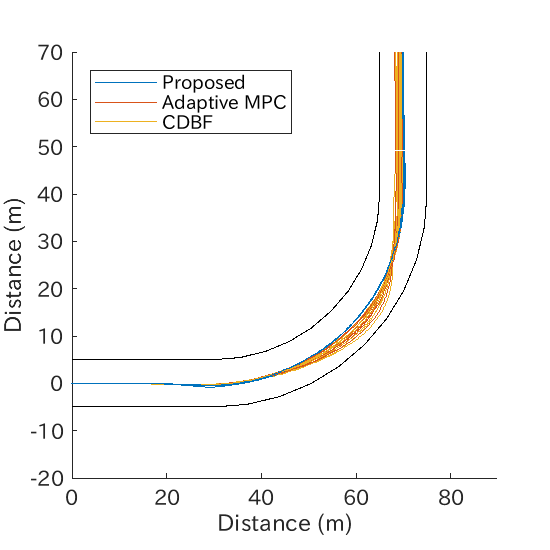

# Adaptive Lane Keeping Simulation

This repository provides Simulink-based **adaptive lane keeping simulations** using **Model Predictive Control (MPC)**.  
The framework includes:

- **Adaptive MPC**: vehicle/road model is updated online using friction coefficient estimation.  
- **Proposed**: Adaptive MPC with additional *Probabilistic Safety Certificate (PSC)* constraints.  
- **CDBF**: Adaptive MPC with *Control-Dependent Barrier Function* constraints.  

The performance of these controllers is compared in terms of **computation time**, **safety probability**, and **vehicle trajectories**.

- **Computational time vs horizon**  
- **Safety probability vs horizon**  
<p align="center">
  
  
</p>

- **Vehicle trajectories for H=10 and H=20**  
<p align="center">
  
  
</p>


---

## 1. Repository structure

```
.
├─ README.md
├─ codes/
│  ├─ mdl_closed_loop_mpc.slx     ← Main Simulink model
│  ├─ main_single_run.m           ← Run one scenario (quick test)
│  ├─ main_parallel_runs.m        ← Run multiple Monte Carlo simulations
│  ├─ impl_controller/            ← MPC, PSC, CDBF implementations
│  ├─ impl_estimator/             ← Friction coefficient estimator
│  ├─ impl_model/                 ← Vehicle and dynamics models
│  ├─ impl_road/                  ← Road description
│  ├─ fun_*                       ← System dynamics, inequality constraints, etc.
│  ├─ mfun_*                      ← Imprementations of MATLAB Functions in Simulink model
│  └─ data_mpc/                   ← Simulation results (saved .mat files)
└─ docs/                          ← Figures, notes
```

---

## 2. Requirements

- MATLAB R2023b or later  
- Simulink  
- Model Predictive Control Toolbox  
- Optimization Toolbox  
- Parallel Computing Toolbox (for `main_parallel_runs.m`)  

---

## 3. How to run

### Step 1: Quick test (single run)

```matlab
cd codes
run('main_single_run.m')
```

- Runs one closed-loop simulation with fixed settings.  
- Useful to check if the model, controller, and estimator are working.  
- Visualization can be turned on/off inside the script.

### Step 2: Data collection (parallel runs)

```matlab
cd codes
run('main_parallel_runs.m')
```

- Launches parallel simulations with random friction coefficients.  
- Saves results (state, trajectory, safety probability, elapsed time) into `.mat` files under `data_mpc/`.  
- Use this script to reproduce the performance plots  

---

## 4. Switching controllers

In both main scripts, you can choose the controller by enabling the corresponding inequality function:

```matlab
% Proposed (Adaptive MPC + PSC)
nlobj.Optimization.CustomIneqConFcn = "fun_inequality";

% CDBF
nlobj.Optimization.CustomIneqConFcn = "fun_inequality_CDBF";

% Adaptive MPC (no safety constraints)
nlobj.Optimization.CustomIneqConFcn = [];
```

---

## 5. Outputs

Each run produces:

- `MU` – true friction coefficient samples  
- `PROB` – safety probability over time  
- `SPEED` – longitudinal speed  
- `TRAJ` – vehicle trajectories  
- `STATE` – full system states  
- `ETIME` – elapsed MPC solve time  

These are stored in `.mat` files such as:

```
data_mpc/data_AMPC_multi_icy_H10.mat
data_mpc/data_CDBF_multi_icy_H10.mat
data_mpc/data_APSC_multi_icy_H10.mat
```

