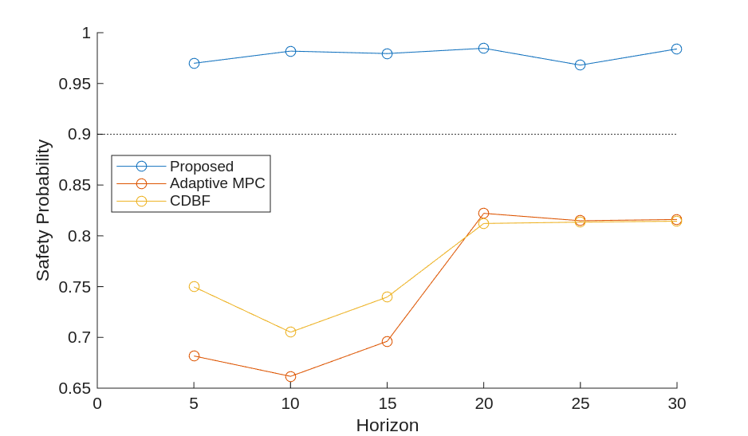
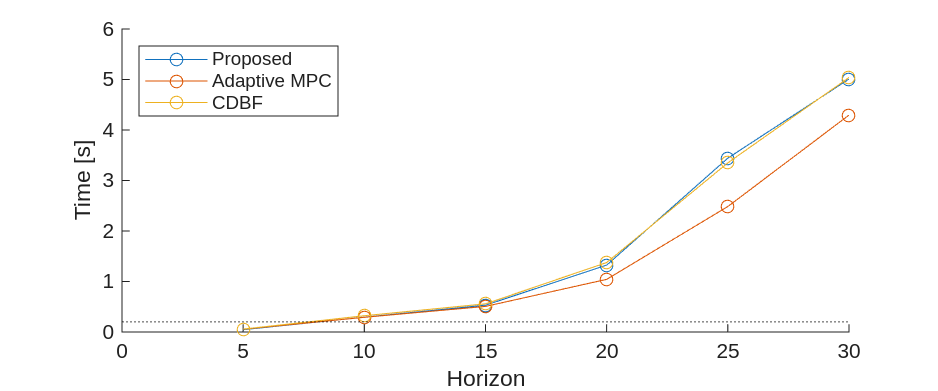

# Adaptive Lane Keeping Simulation

This repository provides Simulink-based **adaptive lane keeping simulations** using **Model Predictive Control (MPC)**.  
The framework includes:

- **Adaptive MPC**: vehicle/road model is updated online using friction coefficient estimation.  
- **Proposed**: Adaptive MPC with additional *Probabilistic Safety Certificate (PSC)* constraints.  
- **CDBF**: Adaptive MPC with *Control-Dependent Barrier Function* constraints.  

The performance of these controllers is compared in terms of **computation time**, **safety probability**, and **vehicle trajectories**.

- **Safety probability vs horizon**  
<p align="center">
  
</p>

- **Computational time vs horizon**  
<p align="center">
  
</p>


- **Vehicle trajectories for H=10 and H=20**  
<p align="center">
  
  
</p>


---

## 1. Repository structure

```
.
├─ README.md
├─ codes/
│  ├─ mdl_closed_loop_mpc.slx     ← Main Simulink model
│  ├─ main_single_run.m           ← Run one scenario (quick test)
│  ├─ main_parallel_runs.m        ← Run multiple parallel simulations
│  ├─ param_sweep_parallel.m      ← Run massive parallel ablation simulations
│  ├─ impl_controller/            ← MPC, PSC, CDBF implementations
│  ├─ impl_estimator/             ← Friction coefficient estimator
│  ├─ impl_model/                 ← Vehicle and dynamics models
│  ├─ impl_road/                  ← Road description
│  ├─ fun_*                       ← System dynamics, inequality constraints, etc.
│  ├─ mfun_*                      ← Imprementations of MATLAB Functions in Simulink model
│  └─ data_mpc/                   ← Simulation results (saved .mat files) and plotting scripts
│       └─ figs_mpc/              ← Ablation trajectory visualizations and statistics
└─ docs/                          ← Simulink Documentations
```

For more details on Simulink implementation, see [docs/model_overview.md](docs/model_overview.md).

---

## 2. Requirements

- MATLAB R2025a — development environment (other versions may or may not be compatible)  
- Simulink  
- Model Predictive Control Toolbox  
- Optimization Toolbox  
- Parallel Computing Toolbox (for `main_parallel_runs.m`)  

---

## 3. How to run

### Step 1: Quick test (single run)

```matlab
cd codes
run('main_single_run.m')
```

- Runs one closed-loop simulation with fixed settings.  
- Useful to check if the model, controller, and estimator are working.  
- Visualization can be turned on/off inside the script:
    ```matlab
    set_param([mdl '/visualization'],'Commented','off') % 'on' to disable
    ```
- For quick checks, the number of Monte Carlo samples for safety probability is initially set to `1`:
    ```matlab
    set_param([mdl '/SafeProbabilityMC'],'snum','1') % change to 100 for reproduction
    ```
  - To properly evaluate the Proposed method (PSC) and obtain meaningful safety probability results, increase this setting to `100` or more. When the friction coefficient is at its lowest value (`mu = 0.2`), using around `200` samples is recommended.


### Step 2: Data collection (parallel runs)

```matlab
cd codes
run('main_parallel_runs.m')
```

- Launches parallel simulations with random friction coefficients.  
- Saves results (state, trajectory, safety probability, elapsed time) into `.mat` files under `data_mpc/`.  
- By default the number of trial runs and the number of parallel pools are
    ```matlab
    num_sims = 2;     % quick check
    num_pools = 2;    % number of workers in parallel pool
    ```
- To reproduce the performance plots
    - Set `num_sims = 30`  
    - Adjust `num_pools` depending on your computational environment.

---

## 4. Switching controllers

In both main scripts, you can choose the controller by enabling the corresponding inequality function:

```matlab
% Proposed (Adaptive MPC + PSC)
nlobj.Optimization.CustomIneqConFcn = "fun_inequality";

% CDBF
nlobj.Optimization.CustomIneqConFcn = "fun_inequality_CDBF";

% Adaptive MPC (no safety constraints)
nlobj.Optimization.CustomIneqConFcn = [];
```

### Note on code generation

- The scripts include an option to generate a MEX function for faster MPC evaluation:
   ```matlab
   code_gen = true;   % build controller as MEX
   ```
- If a MEX has already been built and no changes to the constraints are needed, you can set:
   ```matlab
   code_gen = false;  % reuse previously built MEX (no rebuild)
   ```
- **Important:** If you change the safety constraints (`fun_inequality`, `fun_inequality_CDBF`, etc.), you must re-build the controller (`code_gen = true`) so the compiled MEX matches the new constraints.

---

## 5. Estimation settings (friction coefficient)

In `main_single_run.m` and `main_parallel_runs.m`, the estimator can be configured at the beginning of the script:

```matlab
ONLINE_ESTIMATION = '1';
FIXED_ESTIMATION  = '0';
set_param([mdl '/estimation_sw'],'sw', ONLINE_ESTIMATION)   % '1' for online estimation, '0' for fixed
set_param([mdl '/estimate_fixed'], 'Value',  '[0.30, 0.01]') % Fixed estimate [mean, variance]
set_param([mdl '/prior'],'InitialCondition', '[0.30, 0.01]') % Prior of online estimation [mean, variance]
set_param([mdl '/mes_var'], 'Value', '0.1')                  % Measurement noise variance
```

- By default, online estimation is enabled.
- To test with a fixed friction value, set `FIXED_ESTIMATION` instead.
- The prior mean/variance can be adjusted depending on the scenario.
- `mes_var` controls the assumed measurement noise variance used in the estimator.

---

## 6. Outputs

Each run produces:

- `MU` – true friction coefficient samples  
- `PROB` – safety probability over time  
- `SPEED` – longitudinal speed  
- `TRAJ` – vehicle trajectories  
- `STATE` – full system states  
- `ETIME` – elapsed MPC solve time  

These are stored in `.mat` files such as:

```
data_mpc/data_AMPC_multi_icy_H10.mat
data_mpc/data_CDBF_multi_icy_H10.mat
data_mpc/data_APSC_multi_icy_H10.mat
```

## 

## 7. Parameter ablation runs

To reproduce the ablation experiments and trade-off visualizations:

```
cd codes
run('param_sweep_parallel.m')
```

- This script performs **massive parameter sweeps** (different friction ranges, estimator settings, and controller types).

- It will **take a long time** — approximately **2 days on a workstation with 20 CPU cores**.

- Results are automatically stored under:

  ```
  codes/data_mpc/
  ```

After the sweep completes:

1. **Visualize all trajectories and summary statistics:**

   ```
   run('data_mpc/plot_trajectories_all.m')
   ```

   This generates aggregated trajectory plots and performance metrics inside `data_mpc/figs_mpc/`.

2. **Reproduce the safety–efficiency trade-off plot:**

   ```
   run('data_mpc/tradeoff_plot.m')
   ```

   This script recreates the final trade-off figures used in the paper or documentation.