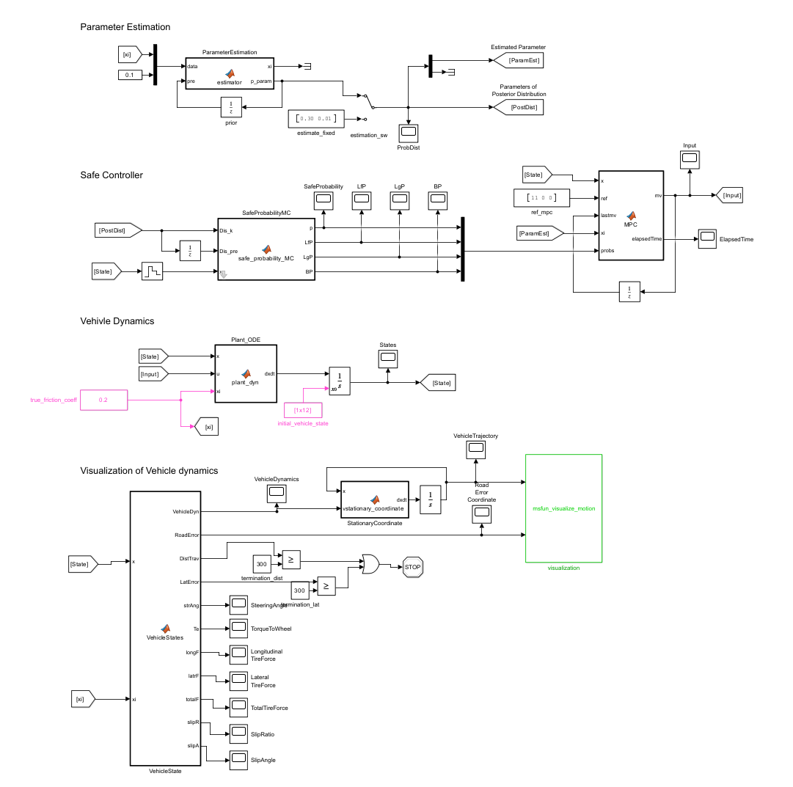

# Simulink Model Overview

This page explains the structure of the Simulink model `mdl_closed_loop_mpc.slx` used in the repository.

  

The model is composed of four main subsystems, corresponding to the labeled blocks in the figure above.

---

## Notes on Code Organization

- The Simulink blocks call external MATLAB functions for clarity and performance.
- **All MATLAB function implementations are located under `mfun_*`** (compiled MEX where applicable) and `fun_*` for symbolic/constraint logic.
- Main entry points:
  - `main_single_run.m` — quick single scenario run and sanity check.
  - `main_parallel_runs.m` — parameter/MU sweeps and data collection.

---

## 1) Parameter Estimation

- Online estimation of the road friction coefficient $\mu$.
- Maintains and outputs parameters of the posterior distribution (mean/variance).
- Feeds the controller with the current estimate for adaptive prediction.
- **Implementation note:** MATLAB function implementation is provided in **`mfun_estimator.m`**.

---

## 2) Safe Controller

- Nonlinear MPC with three selectable modes:
  - **Adaptive MPC** (no additional safety constraints).
  - **Proposed**: Adaptive MPC with *Probabilistic Safety Certificate (PSC)* constraints.
  - **CDBF**: Adaptive MPC with *Control-Dependent Barrier Function* constraints.
- Safety constraints are formed via **`fun_inequality.m`**, **`fun_inequality_CDBF.m`**, and **`fun_safety_condition.m`**.
- **Fast execution:** the generated MPC move function is **`mfun_mpc_controller.mexw64`** (from `nlmpcmoveCodeGeneration`).

---

## 3) Vehicle Dynamics

- Nonlinear vehicle dynamics including tire forces dependent on $\mu$.
- Implemented in **`fun_system_dynamics.m`** (state update) and **`fun_output_function.m`** (outputs).
- The *true* friction coefficient is injected into the plant block for ground-truth simulation.
- Initial conditions (longitudinal speed, wheel angular velocities, road pose) are set by `initial_vehicle_state`.

---

## 4) Visualization of Vehicle Dynamics

- Collects and visualizes key variables: lateral error, yaw, forces, slip ratio/angle, etc.
- Animated visualization of the trajectory is implemented in **`msfun_visualize_motion.m`**.
- Termination conditions (distance and lateral error) are monitored to stop the simulation and log the outcome.

