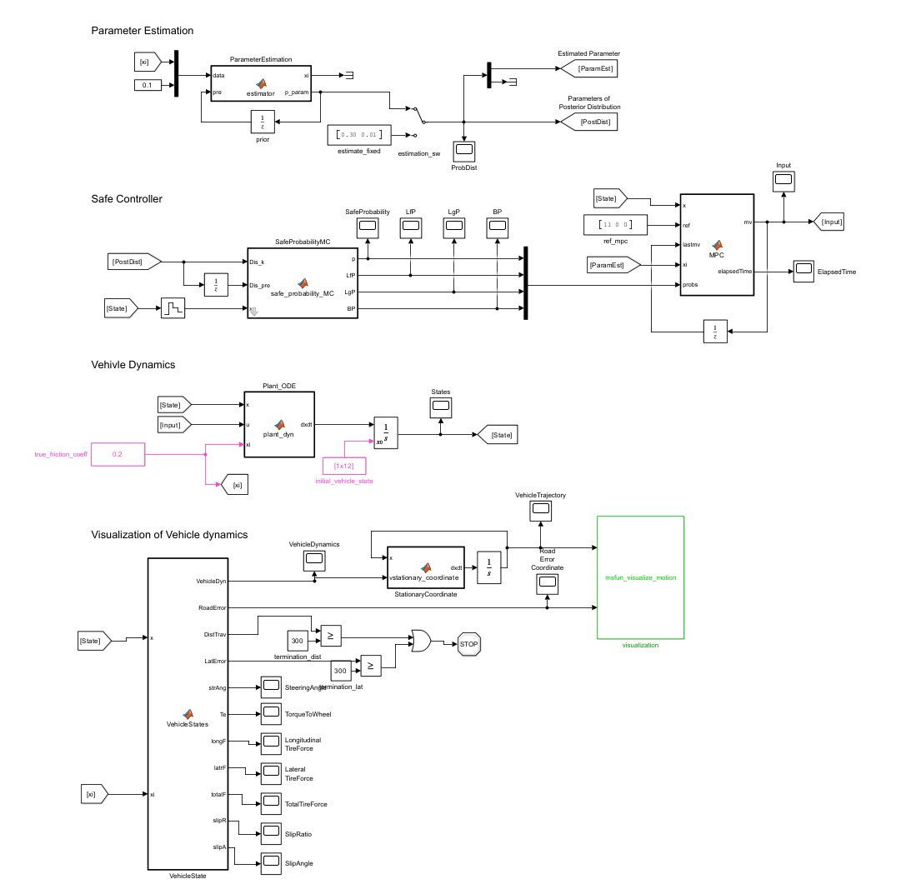

# Simulink Model Overview

This page explains the structure of the Simulink model `mdl_closed_loop_mpc.slx` used in the repository.

<p align="center">
  
</p>

The model is composed of four main subsystems, corresponding to the labeled blocks in the figure above.

---

## Notes on Code Organization

- The Simulink blocks call external MATLAB functions for clarity and performance.
- **All MATLAB function implementations are located under `mfun_*`** (compiled MEX where applicable) and `fun_*` for symbolic/constraint logic.
- Main entry points:
  - `main_single_run.m` — quick single scenario run and sanity check.
  - `main_parallel_runs.m` — parameter/MU sweeps and data collection.

---

## 1) Parameter Estimation

- Online estimation of the road friction coefficient $\mu$.
- Maintains and outputs parameters of the posterior distribution (mean/variance).
- Feeds the controller with the current estimate for adaptive prediction.
- **Implementation note:** MATLAB function implementation is provided in **`mfun_estimator.m`**.

---

## 2) Safe Controller

- Nonlinear MPC with three selectable modes:
  - **Adaptive MPC** (no additional safety constraints).
  - **Proposed**: Adaptive MPC with *Probabilistic Safety Certificate (PSC)* constraints.
  - **CDBF**: Adaptive MPC with *Control-Dependent Barrier Function* constraints.
- Safety constraints are formed via **`fun_inequality.m`**, **`fun_inequality_CDBF.m`**, and **`fun_safety_condition.m`**.
- **Fast execution:** the generated MPC move function is **`mfun_mpc_controller.mexw64`** (from `nlmpcmoveCodeGeneration`).

### Barrier Functions and Phi Expressions

The safety condition is defined by a **barrier function** $\phi(e)$ that determines when the vehicle is considered "safe" based on lateral error $e$:

$$\phi(e) > 0 \Leftrightarrow \text{safe}, \quad \phi(e) \leq 0 \Leftrightarrow \text{unsafe}$$

The default barrier function is quadratic: $\phi(e) = 1 - (e/e_{max})^2$

**Key Insight:** The impact of different barrier function shapes (phi expressions) depends entirely on the safety method:

| Safety Method | Uses `fun_safety_condition` | Phi Expressions Matter? |
|--------------|---------------------------|------------------------|
| **PSC** (Proposed) | ✅ Yes | ✅ **YES** - Used in Monte Carlo to calculate $p$, $L_fP$, $L_gP$, $B_P$ |
| **CDBF** | ❌ No | ❌ No - Uses vehicle dynamics directly |
| **DIRECT** | ❌ No | ❌ No - Hardcoded constraint |
| **NONE** (AMPC) | ❌ No | ❌ No - No safety constraints |

**To compare different phi expressions**, use the script **`compare_phi_expressions.m`** with `SAFETY_METHOD = 'PSC'`. This script systematically tests multiple barrier function formulations:

```matlab
% In compare_phi_expressions.m:
SAFETY_METHOD = 'PSC';  % Required for phi comparison
phi_list = {
    '1 - (e/emax)^2',          'quadratic (default)';
    '1 - (e/emax)^4',          'quartic';
    'cos(pi*e/(2*emax))',       'cosine';
    '1 - abs(e/emax)',          'linear';
};
```

Each expression changes the shape of the safety boundary, affecting:
- **Safety probability** $p$ - likelihood of staying within bounds
- **Lie derivatives** $L_fP$, $L_gP$ - how quickly safety changes
- **Controller behavior** - conservatism vs performance trade-off

---

## 3) Vehicle Dynamics

- Nonlinear vehicle dynamics including tire forces dependent on $\mu$.
- Implemented in **`fun_system_dynamics.m`** (state update) and **`fun_output_function.m`** (outputs).
- The *true* friction coefficient is injected into the plant block for ground-truth simulation.
- Initial conditions (longitudinal speed, wheel angular velocities, road pose) are set by `initial_vehicle_state`.

---

## 4) Visualization of Vehicle Dynamics

- Collects and visualizes key variables: lateral error, yaw, forces, slip ratio/angle, etc.
- Animated visualization of the trajectory is implemented in **`msfun_visualize_motion.m`**.
- Termination conditions (distance and lateral error) are monitored to stop the simulation and log the outcome.